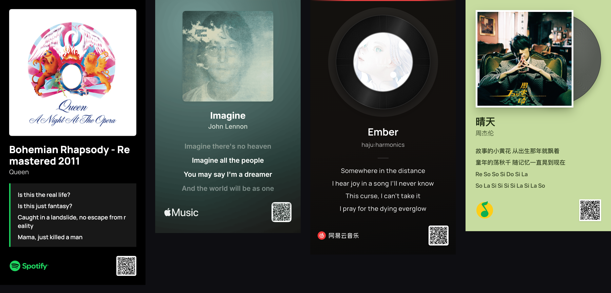
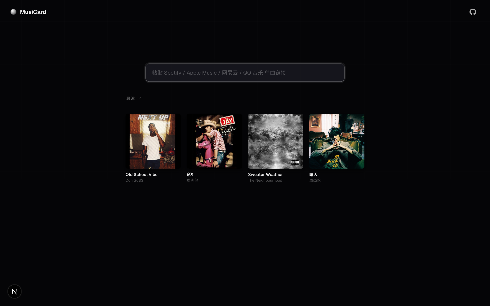
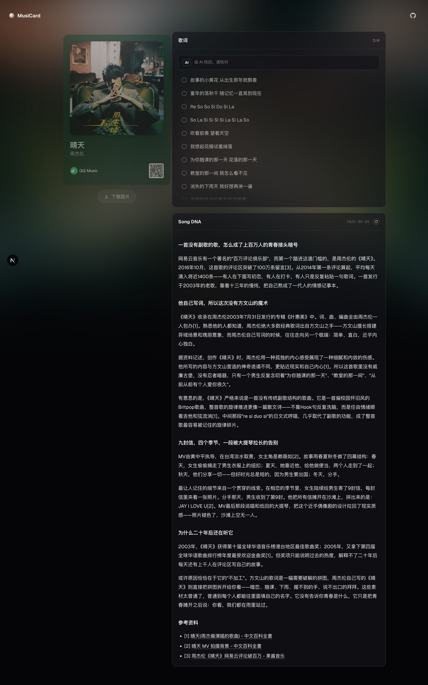

# MusiCard

> 链接人类的，我希望不是链接。

<p align="center">
  
</p>

<p align="center">
  把一首歌变成一张能直接发出去的图。<br/>
  <sub>Spotify · Apple Music · 网易云 · QQ 音乐</sub>
</p>

<p align="center">
  <a href="https://ohmydna.com"><b>▶ Live</b></a>
</p>

---

## 为什么

国内分享 Spotify / Apple Music 歌曲是件别扭事 —— 都是一些难看的链接，大家可能都不愿意点。

MusiCard 把分享压成**一张图**：歌名、艺人、封面、可选歌词、扫码直达，**对方不用点任何链接**。

网易云和 QQ 音乐是我用过最久的两个国内播放器，所以一起加上 —— 致敬一起陪了很多年。

## 卡片

<p align="center">
  
</p>
<p align="center">
  <sub>Spotify · Apple Music · 网易云 · QQ 音乐</sub>
</p>

## 怎么用

1. 粘贴单曲链接
2. 自动取歌词，勾最多 4 句上卡
3. 下载 1920px PNG，直接转发

支持的链接格式：

```
https://open.spotify.com/track/<id>
https://music.apple.com/.../?i=<id>
https://music.163.com/#/song?id=<id>
https://y.qq.com/n/ryqq/songDetail/<songmid>
```

每首歌还会拿到一个可分享的短路径，如 `/qq-0039MnYb0qxYhV` —— 浏览器后退、收藏夹都按预期工作。

## 歌词

每个平台拿歌词的路径不同：

- **网易云 / QQ 音乐** 直接走自家 lyrics API（最权威），miss 就直接交给 AI 兜底，不再绕 LRCLIB
- **Spotify / Apple Music** 走 [LRCLIB](https://lrclib.net) 时间戳歌词库；miss 后并行的 AI 调用接力

整个 race 跟前端 `useTrackInfo` 共享 AbortController，先来先用，另一边自动取消。

## 历史 & 专辑合并

<p align="center">
  
</p>

最近浏览的歌按时间倒序展示在首页。同一张专辑的多首会自动折叠成一张卡（点击展开列表），跨平台也算 —— Spotify 上的"七里香"和 QQ 上的"七里香"按 `normalize(艺人) + normalize(专辑名)` 合并成一张。

## SONG-DNA

<p align="center">
  
</p>

> 点一下让 AI 给你写这首歌的故事 —— 创作背景、方文山 vs 周杰伦自填词、MV 拍摄花絮、获奖记录，带参考资料链接。流式生成 + 落库缓存，下次秒开。

## 自己部署

```bash
git clone https://github.com/shadycheer/MusiCard.git
cd MusiCard
cp .env.local.example .env.local   # 填环境变量
pnpm install                       # 或 npm install
node scripts/migrate.mjs           # 初始化 Neon schema
pnpm dev
```

环境变量：
- `DATABASE_URL` — [Neon Postgres](https://neon.tech)（卡片 / 歌词 / Song DNA 缓存）
- `SPOTIFY_CLIENT_ID` / `SPOTIFY_CLIENT_SECRET` — [Spotify Developer App](https://developer.spotify.com/dashboard)
- `OPENROUTER_API_KEY` — 可选，开启 AI 歌词 + Song DNA

QQ 音乐 / 网易云 / Apple Music 都直接走平台公开接口，**不需要任何 key**。

## 技术

- **Next.js 16** App Router + React 19 + TypeScript
- **Canvas 2D** 导出 1920px 卡片，`next/font` 自托管 Manrope / Inter / 思源
- **Neon Postgres** 做 tracks / lyrics / song_dna 三张缓存表
- **OpenRouter** 流式调 Claude / Gemini 系列（Song DNA + AI 歌词回退）
- **three.js** Song DNA 螺旋粒子动画
- 每家平台一个独立 fetcher（`upstream.ts`），失败 fail-open 不影响其他

## 致谢

- [Spotify Web API](https://developer.spotify.com/) · [iTunes Lookup](https://itunes.apple.com/lookup)
- [LRCLIB](https://lrclib.net) 同步歌词（Spotify / Apple Music 走这条线）
- 网易云 weapi 反代理协议（社区逆向）—— song detail + lyric 一并拿
- QQ 音乐 `c.y.qq.com` 的 `fcg_play_single_song` + `fcg_query_lyric_new` 公开端点
- Wikimedia Commons 的 QQ Music 2023 / 网易云 / Apple Music / Spotify 官方 logo SVG（商标各自所有）

## License

MIT
