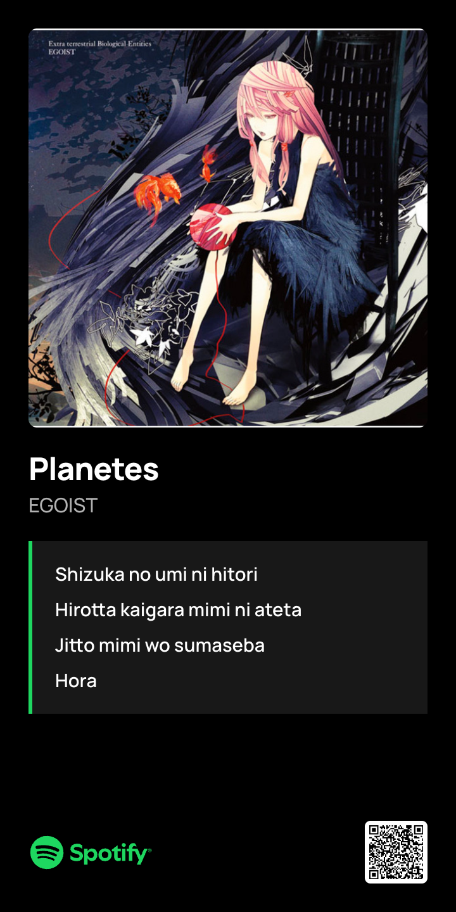
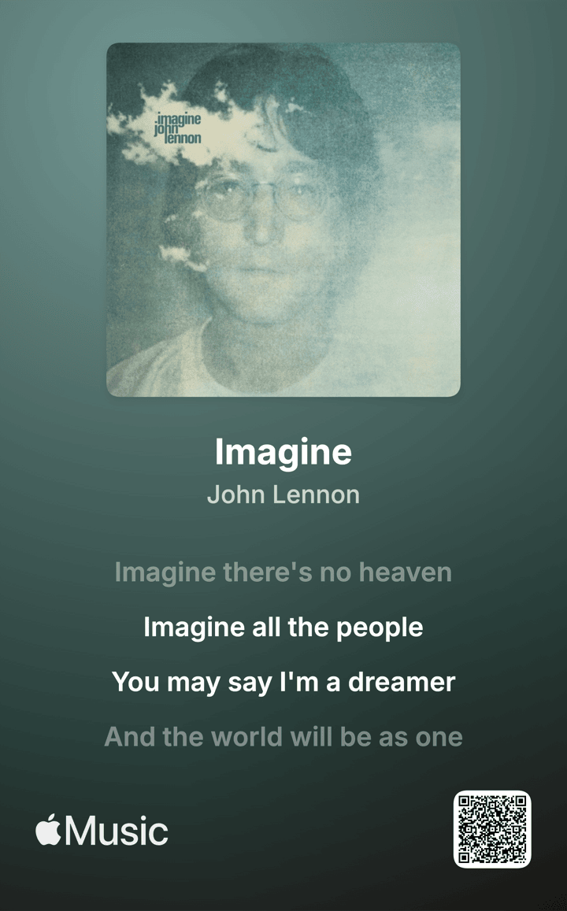
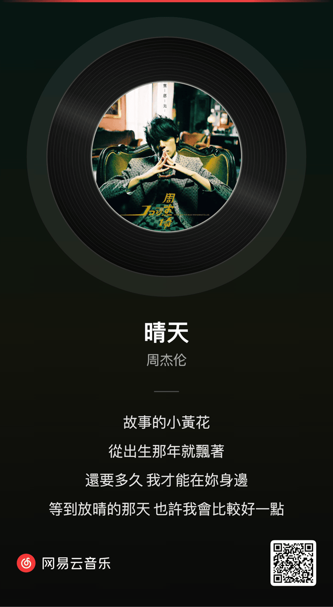

# MusiCard

> 链接人类的，我希望不是链接。

<p align="center">
  
</p>

<p align="center">
  把一首歌变成一张能直接发出去的图。<br/>
  <sub>Spotify · Apple Music · 网易云</sub>
</p>

<p align="center">
  <a href="https://ohmydna.com"><b>▶ Live</b></a>
</p>

---

## 为什么

国内分享 Spotify / AppleMusic 歌曲是件别扭事 —— 都是一些难看的链接，大家可能都不愿意点。

MusiCard 把分享压成**一张图**：歌名、艺人、封面、可选歌词、扫码直达，**对方不用点任何链接**。

网易云则是我很喜欢的音乐软件，因此一起加上，致敬我曾使用过的 13 年。

## 卡片

<table>
  <tr>
    <td align="center" width="33%">
      <br/>
      <sub><b>Spotify</b></sub>
    </td>
    <td align="center" width="33%">
      <br/>
      <sub><b>Apple Music</b></sub>
    </td>
    <td align="center" width="33%">
      <br/>
      <sub><b>网易云</b></sub>
    </td>
  </tr>
</table>

## 怎么用

1. 粘贴单曲链接
2. 自动取歌词，勾最多 4 句上卡
3. 下载 1920px PNG，直接转发

支持的链接格式：

```
https://open.spotify.com/track/<id>
https://music.apple.com/.../?i=<id>
https://music.163.com/#/song?id=<id>
```

> 还有个小玩具 **SONG-DNA**：点一下让 AI 给你写一段这首歌的故事。

## 自己部署

```bash
git clone https://github.com/shadycheer/MusiCard.git
cd MusiCard
cp .env.local.example .env.local   # 填环境变量
npm install
node scripts/migrate.mjs
npm run dev
```

需要：[Spotify Developer App](https://developer.spotify.com/dashboard) · [Neon Postgres](https://neon.tech)· 可选 [OpenRouter](https://openrouter.ai)（SONG-DNA / AI Lyrics）

## 技术

Next.js 16 · TypeScript · Canvas 2D · Neon Postgres · `next/font` 自托管 Manrope / Inter · three.js（SONG-DNA helix）

## 致谢

[Spotify Web API](https://developer.spotify.com/) · [iTunes Lookup](https://itunes.apple.com/lookup) · [LRCLIB](https://lrclib.net) · Apple Music / Spotify 官方 lockup SVG（商标各自所有）

## License

MIT
